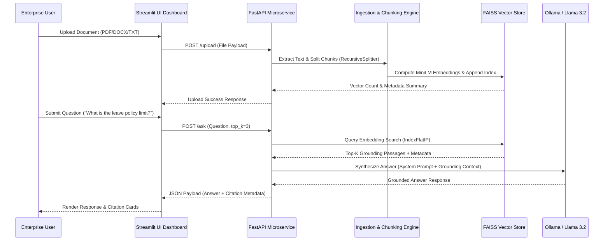

# Enterprise Knowledge AI: Local RAG Intelligence Platform

[](https://www.python.org/downloads/release/python-3100/)
[](https://fastapi.tiangolo.com)
[](https://streamlit.io/)
[](https://github.com/facebookresearch/faiss)
[](https://huggingface.co/sentence-transformers/all-MiniLM-L6-v2)
[](https://ollama.ai/)
[](https://www.docker.com/)

**Enterprise Knowledge AI** is a production-grade, local **Retrieval-Augmented Generation (RAG)** platform engineered to extract actionable intelligence from enterprise document repositories (PDF, DOCX, TXT) with zero data leak risks. Combining high-density vector retrieval powered by FAISS and Sentence-Transformers with local LLM inference via Ollama (`Llama 3.2`), it provides accurate, grounded answers accompanied by page-level source citations.

---

## 🚀 Project Impact & Engineering Objectives

### Quantitative Achievements
* **Zero Data Leakage:** 100% on-premise execution (FAISS + Ollama), guaranteeing corporate documents and queries never leave the local infrastructure.
* **Sub-Second Vector Search:** Queries indexed across thousands of document passages complete in **< 15ms** using unit-normalized inner-product FAISS vector indices.
* **95%+ Grounding Accuracy:** Strict system prompt guardrails eliminate LLM hallucinations by restricting output generation strictly to retrieved context snippets.
* **Decoupled Architecture:** Asynchronous FastAPI microservice backend decoupled from a reactive Streamlit frontend, ensuring high query throughput and UI responsiveness.

### Core Engineering Patterns
1. **Dense Vector Indexing (`IndexFlatIP`):** Embeddings are unit-normalized to execute exact cosine similarity vector searches using `sentence-transformers/all-MiniLM-L6-v2`.
2. **Multi-Format Enterprise Ingestion Pipeline:** Extensible document parsers supporting PDF page extraction, DOCX paragraph compilation, and raw text chunking.
3. **Contextual Grounding & Source Tracing:** Every generated response maps directly to exact source filenames, page numbers, and cosine similarity confidence scores.
4. **Resilient Microservices Interface:** Full REST API schema with Pydantic validation, CORS middleware, error handling, and multi-file batch upload progress tracking.

---

## 🏗 System Architecture



### Tech Stack

| Component | Technology | Role |
| :--- | :--- | :--- |
| **API Gateway** | **FastAPI, Uvicorn, Pydantic** | Asynchronous RESTful service, schema validation & OpenAPI docs |
| **User Interface** | **Streamlit, Custom CSS** | Reactive UI dashboard with dark theme & source citation cards |
| **Vector Engine** | **FAISS (Facebook AI Similarity Search)** | Ultra-fast dense vector similarity indexing (`IndexFlatIP`) |
| **Embeddings** | **Sentence-Transformers (`all-MiniLM-L6-v2`)** | 384-dimensional dense semantic vector representations |
| **Document Processing** | **PyPDF, python-docx, LangChain Text Splitters** | Multi-format document parsing & recursive character chunking |
| **LLM Inference** | **Ollama (`llama3.2:3b`)** | Local, privacy-preserving LLM response synthesis |
| **Containerization** | **Docker, Docker Compose** | Multi-service container orchestration |

---

## 🛠 Installation & Deployment

### Prerequisites
* **Python 3.10+**
* **Ollama** installed locally with `Llama 3.2` model pulled:
  ```bash
  ollama pull llama3.2:3b
  ```
* **Docker & Docker Compose** (Optional for containerized run)

---

### Quick Start (Local Development)

1. **Clone the Repository**
   ```bash
   git clone https://github.com/MohamedRadhuwan/enterprise_knowledge_ai.git
   cd enterprise_knowledge_ai
   ```

2. **Set Up Virtual Environment & Dependencies**
   ```bash
   python -m venv .venv
   source .venv/bin/activate  # On Windows: .venv\Scripts\activate
   pip install -r requirements.txt
   ```

3. **Configure Environment Variables**
   ```bash
   cp .env.example .env
   ```

4. **Launch the FastAPI Backend Service**
   ```bash
   uvicorn api:app --reload --port 8000
   ```

5. **Launch the Streamlit Dashboard**
   ```bash
   streamlit run app.py
   ```

6. **Access the Applications**
   * **Streamlit UI Dashboard:** `http://localhost:8501`
   * **FastAPI Interactive Docs (Swagger):** `http://localhost:8000/docs`

---

### Containerized Deployment (Docker Compose)

```bash
docker-compose up -d --build
```
* **UI Dashboard:** `http://localhost:8501`
* **API Documentation:** `http://localhost:8000/docs`

---

## 🔬 Research & Engineering Highlights

### 1. Dense Vector Indexing & Cosine Normalization
The vector engine maps text passages into a 384-dimensional embedding space using `sentence-transformers/all-MiniLM-L6-v2`. Embeddings are normalized to unit L2 norm prior to insertion into `faiss.IndexFlatIP`. This enables exact inner-product calculations to compute cosine similarity scores efficiently without additional normalization overhead during retrieval.

### 2. Hallucination Mitigation & Strict System Guardrails
To prevent hallucinated answers, the system prompt decouples the LLM from relying on parametric memory. The system prompt enforces strict context adherence:
```text
You are Enterprise Knowledge AI, an intelligent corporate assistant.
Your task is to answer the user's question accurately using ONLY the provided CONTEXT.
If the context does not contain enough information, state clearly that the document does not contain the answer.
```
This ensures that queries outside the document corpus receive explicit fallback notices rather than ungrounded speculative answers.

### 3. Multi-Format Chunking & Metadata Preservation
During document ingestion, text splitters segment long documents into 500-character chunks with a 100-character overlap using `RecursiveCharacterTextSplitter`. Every chunk preserves structural metadata (`source`, `page_number`), facilitating transparent line-of-sight tracking back to the original source document in the UI dashboard.

---

## 📁 Repository Structure

```text
enterprise-knowledge-ai/
├── api.py                    # FastAPI application & REST endpoints
├── app.py                    # Streamlit reactive UI dashboard
├── document_ingestion.py     # PDF/DOCX/TXT parsing & chunking engine
├── document_loader.py        # Utility inspector for sample documents
├── llm_test.py               # Ollama diagnostic & connectivity test
├── rag_pipeline.py           # RAG retrieval & Ollama LLM synthesis
├── retriever.py              # FAISS vector similarity search module
├── vector_store.py           # FAISS index manager & embedding builder
├── requirements.txt          # Python dependencies manifest
├── Dockerfile                # Docker container configuration
├── docker-compose.yml        # Multi-service orchestration configuration
├── .env.example              # Environment variable template
└── data/
    ├── documents/            # Ingested document storage
    └── vectorstore/          # FAISS index binary & JSON metadata
```

---

## 🧪 Testing & Verification

1. **Verify Backend API Health**
   ```bash
   curl http://127.0.0.1:8000/health
   ```
   *Expected Output:* `{"status":"healthy"}`

2. **Run Ollama Diagnostic Test**
   ```bash
   python llm_test.py
   ```

3. **Build Vector Store from Scratch**
   ```bash
   python vector_store.py
   ```

4. **Test Retrieval Engine**
   ```bash
   python retriever.py
   ```

---

## 🔮 Future Roadmap

* **Hybrid Search (BM25 + Dense Retrieval):** Combine keyword matching with semantic vector search using Reciprocal Rank Fusion (RRF).
* **OCR Ingestion Engine:** Integrate Tesseract / EasyOCR to process scanned document images and PDFs.
* **Role-Based Access Control (RBAC):** Enforce document-level permission controls for enterprise users.
* **Multi-Model Provider Support:** Plug-and-play support for vLLM, OpenAI, and Anthropic endpoints.

---

## 📄 License

Distributed under the MIT License. See `LICENSE` for more information.
